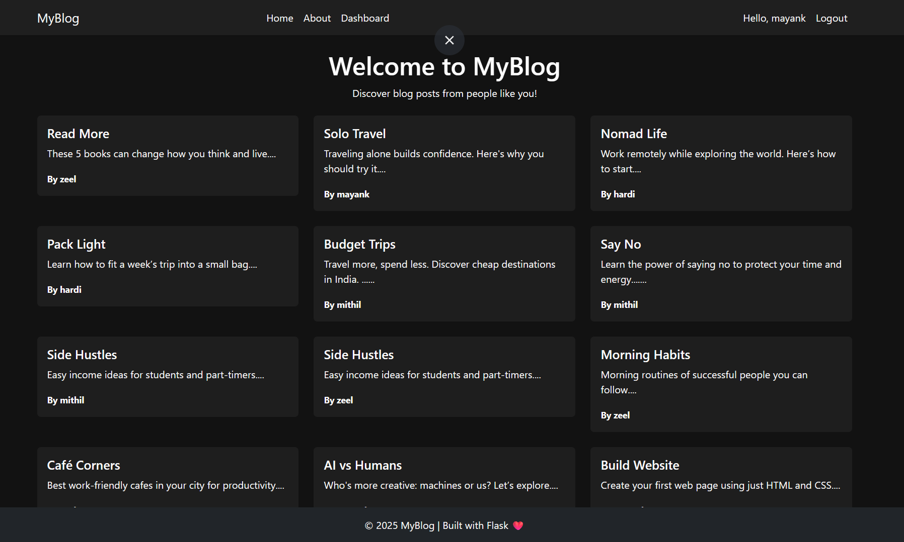
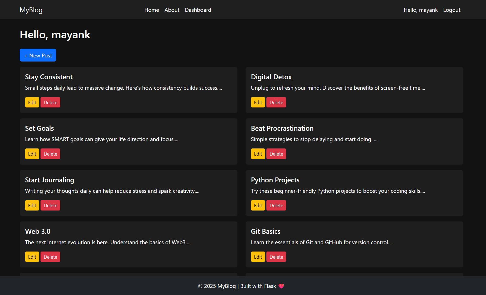

# 📝 MyBlog – Personal Blog Web Application

A full-featured personal blog web application with user registration, authentication, post management, and a responsive Bootstrap interface — built using Flask and SQLAlchemy.

---

## 🚀 Features

- User Signup & Login
- Create, Edit, and Delete Blog Posts
- Dashboard for Managing Posts
- View All Posts from All Users
- Responsive Design with Bootstrap
- Session-Based User Authentication

---

## 📸 Preview

*Home Page*


*User Dashboard*



---

## 🛠️ Installation

1. Clone the repository:

```bash
git clone https://github.com/MayankRojivadiya/Blog-App.git
cd Blog-App
- python -m venv env
  env\Scripts\activate
- pip install -r requirements.txt

```python
from app import db, app

with app.app_context():
    db.create_all()

```bash
python app.py

